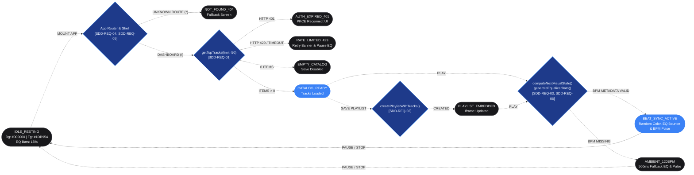

# Artifact 5: Logic & State Flowcharts

## 1. Core Logic & State Transitions

```mermaid
flowchart LR
    %% Antivibe State Tracker Styling
    classDef stateNode fill:#18181b,stroke:#3f3f46,stroke-width:1px,color:#f4f4f5,rx:30,ry:30
    classDef decisionNode fill:#1e3a8a,stroke:#60a5fa,stroke-width:2px,color:#eff6ff
    classDef biCursor fill:#3b82f6,stroke:none,color:#ffffff,rx:15,ry:15
    classDef default color:#a1a1aa

    %% Node Definitions
    A(["IDLE_RESTING<br/>Bg: #000000 | Fg: #1DB954<br/>EQ Bars: 15%"]):::stateNode
    B{"App Router & Shell<br/>[SDD-REQ-04, SDD-REQ-05]"}:::decisionNode
    C(["NOT_FOUND_404<br/>Fallback Screen"]):::stateNode
    D{"getTopTracks(limit=50)<br/>[SDD-REQ-01]"}:::decisionNode
    E(["AUTH_EXPIRED_401<br/>PKCE Reconnect UI"]):::stateNode
    F(["RATE_LIMITED_429<br/>Retry Banner & Pause EQ"]):::stateNode
    G(["EMPTY_CATALOG<br/>Save Disabled"]):::stateNode
    H(["CATALOG_READY<br/>Tracks Loaded"]):::biCursor
    I{"createPlaylistWithTracks()<br/>[SDD-REQ-02]"}:::decisionNode
    J(["PLAYLIST_EMBEDDED<br/>Iframe Updated"]):::stateNode
    K{"computeNextVisualState()<br/>generateEqualizerBars()<br/>[SDD-REQ-03, SDD-REQ-06]"}:::decisionNode
    L(["BEAT_SYNC_ACTIVE<br/>Random Color, EQ Bounce & BPM Pulse"]):::biCursor
    M(["AMBIENT_120BPM<br/>500ms Fallback EQ & Pulse"]):::stateNode

    %% Transition Paths
    A -. "MOUNT APP" .-> B
    B -. "UNKNOWN ROUTE (*)" .-> C
    B -. "DASHBOARD (/)" .-> D
    D -. "HTTP 401" .-> E
    D -. "HTTP 429 / TIMEOUT" .-> F
    D -. "0 ITEMS" .-> G
    D -. "ITEMS > 0" .-> H
    H -. "SAVE PLAYLIST" .-> I
    I -. "CREATED" .-> J
    H -. "PLAY" .-> K
    J -. "PLAY" .-> K
    K -. "BPM METADATA VALID" .-> L
    K -. "BPM MISSING" .-> M
    L -. "PAUSE / STOP" .-> A
    M -. "PAUSE / STOP" .-> A
```
